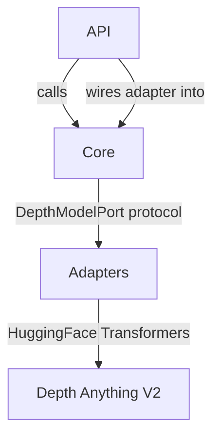

# Architecture Base — backend

> Python FastAPI service providing ML-powered depth estimation for converting 2D images into 3D parallax layers.

## Pattern

Hexagonal (Ports & Adapters): core business logic defines a `DepthModelPort` protocol; adapters implement it for specific ML models. The FastAPI server wires adapters to endpoints. Core never imports adapters or framework code. Adapters never import core logic — they implement the port interface.

## Arms

| Arm      | Role                                                      | Root Path                        | Key Files                                |
| -------- | --------------------------------------------------------- | -------------------------------- | ---------------------------------------- |
| API      | FastAPI endpoints, CORS middleware, request handling      | `backend/`                       | `app.py`                                 |
| Core     | Pure business logic — depth normalization, image encoding | `backend/comic_engine/core/`     | `depth.py`, `image_utils.py`, `ports.py` |
| Adapters | ML model wrappers implementing DepthModelPort             | `backend/comic_engine/adapters/` | `depth_anything.py`                      |

## Connections

## Domain Notes

- **Port pattern**: `DepthModelPort` in `ports.py` is a `Protocol` class — adapters implement it without inheriting
- **Lazy model loading**: `DepthAnythingV2Adapter` loads the model on first call, auto-detects device (MPS/CUDA/CPU)
- **Image contract**: API accepts multipart image upload, returns PNG with `X-Depth-Width` and `X-Depth-Height` response headers
- **Testing**: pytest; unit tests for core logic (`test_depth.py`, `test_image_utils.py`), integration tests for API (`test_app.py`), adapter tests (`test_depth_anything.py`)
- **Naming**: snake_case functions, PascalCase classes, no constants file — values inline
