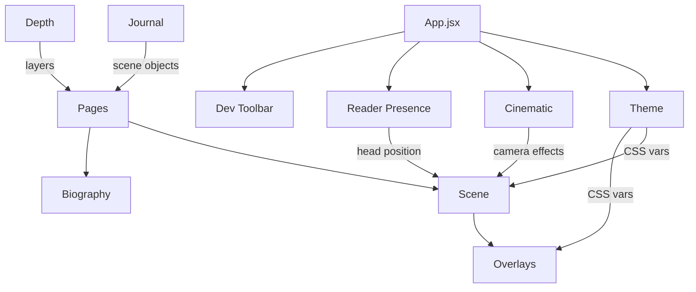

# Architecture Base — frontend

> React SPA for composing interactive comic scenes with 3D parallax, cinematic camera effects, and data-driven storytelling.

## Pattern

Context-Composition: nested React context providers drive all state (theme, scene, cinematic, reader presence). Pages compose Scene → SceneObject → Panel hierarchies. No Redux — contexts are the state layer. UI is data-driven: scene JSON files generate pages, card type registries generate components.

## Arms

| Arm             | Role                                                             | Root Path                   | Key Files                                                         |
| --------------- | ---------------------------------------------------------------- | --------------------------- | ----------------------------------------------------------------- |
| Theme           | Color/typography/effects presets, CSS variable injection         | `src/theme/`                | `ThemeContext.jsx`, `themes.js`                                   |
| Scene           | 3D parallax engine, camera, object registry, edit mode           | `src/components/scene/`     | `Scene.jsx`, `SceneObject.jsx`, `Panel.jsx`, `cardTypes.jsx`      |
| Overlays        | Composable post-processing effects (grain, vignette, particles…) | `src/components/overlays/`  | `index.jsx` (OverlayStack), `FilmGrain.jsx`, `Particles.jsx`      |
| Cinematic       | Camera effects — letterbox, shake, flash, zoom                   | `src/components/`           | `CinematicCamera.jsx`                                             |
| Reader Presence | Webcam head-tracking for physical parallax input                 | `src/components/`           | `ReaderPresence.jsx`                                              |
| Pages           | Top-level route compositions combining scenes + overlays         | `src/pages/`                | `DynamicScenePage.jsx`, `JournalPage.jsx`, `ExamplePage.jsx`      |
| Journal         | Obsidian markdown → scene object pipeline                        | `src/journal/`              | `parser.js`, `sceneGenerator.js`, `schema.js`                     |
| Depth           | Image → depth map → 3D layers client pipeline                    | `src/utils/depth/`          | `pipeline.js`, `segmentation.js`, `depthEstimation.js`            |
| Biography       | Character metadata, memory wizard, timeline visualization        | `src/components/biography/` | `biographySchema.js`, `MemoryInputWizard.jsx`, `TimelineView.jsx` |
| Dev Toolbar     | Dynamic panel registration for dev controls                      | `src/components/`           | `DevToolbar.jsx`                                                  |

## Connections

## Domain Notes

- **Context+Hook pattern everywhere**: `createContext` → `Provider` wrapper → `useX()` hook with null-check throw
- **No TypeScript**: types via JSDoc `@typedef` in schema files and destructured props
- **Card type registry**: metadata in `cardTypesData.js`, React rendering in `cardTypes.jsx` — extend both to add a new card type
- **CSS 3D transforms** for parallax: `translate3d(x + parallax, y + parallax, z)` — never use 2D transforms in Scene
- **Testing**: Vitest + React Testing Library + jsdom; canvas/WebGL mocked via `vi.fn()`
- **Build**: Vite with custom `vite-plugin-scene-exporter.js` that watches `/local-scenes/*.json` and generates route components
- **Naming**: Components PascalCase, hooks `useX`, utils camelCase, constants UPPER_SNAKE_CASE
