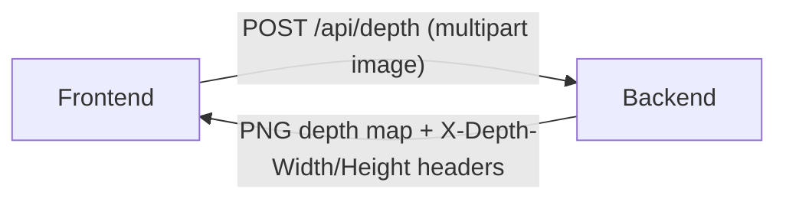

# Architecture Base

> Interactive comic engine with 3D parallax scenes, cinematic effects, and data-driven storytelling.

## Products

| Product  | Role                                                                         | Root Path  | Base               |
| -------- | ---------------------------------------------------------------------------- | ---------- | ------------------ |
| frontend | React SPA — parallax scene engine, overlays, cinematic effects, scene editor | `src/`     | `base-frontend.md` |
| backend  | Python FastAPI ML service — depth estimation for 3D layer extraction         | `backend/` | `base-backend.md`  |

## Product Connections

## Cross-Product Notes

- Frontend and backend are fully decoupled — frontend is a React SPA, backend is a Python FastAPI server. No shared code or types.
- Dev proxy: Vite proxies `/api` to `http://localhost:5666` (backend) during development
- The only integration point is the `/api/depth` endpoint — frontend sends an image, backend returns a depth map PNG
- Frontend uses JavaScript (no TypeScript); backend uses Python with type hints
